# Languages

- [Türkçe](#gen-i̇fadesi-veri-setleri-üzerinde-gen-analizleri-ve-makine-öğrenmesi-ile-hepatosellüler-karsinom-sınıflandırması
)
- [English](#gene-expression-analysis-and-machine-learningbased-classification-of-hepatocellular-carcinoma
)

# Gen İfadesi Veri Setleri Üzerinde Gen Analizleri ve Makine Öğrenmesi ile Hepatosellüler Karsinom Sınıflandırması

**BLM3810 Biyoenformatiğe Giriş — Dönem Projesi**

Yıldız Teknik Üniversitesi · Bilgisayar Mühendisliği Bölümü

Dr. S. Sevgi TURGUT ÖGME

Haziran, 2026

---

## İçindekiler

- [Giriş](#giriş)
- [Veri Seti ve Ön İşleme](#veri-seti-ve-ön-işleme)
- [Diferansiyel Gen İfadesi Analizi](#diferansiyel-gen-i̇fadesi-analizi)
- [Survival Analizi ve Cox Modeli](#survival-analizi-ve-cox-modeli)
- [WGCNA Analizi](#wgcna-analizi)
- [GO Enrichment Analizi](#go-enrichment-analizi)
- [Makine Öğrenmesi ile Sınıflandırma](#makine-öğrenmesi-ile-sınıflandırma)
- [Sonuçlar](#sonuçlar)
- [Kısaltmalar](#kısaltmalar)

---

## Giriş

Kanser, hücre büyümesinin kontrolden çıkması sonucu ortaya çıkan ve dünya genelinde önde gelen ölüm nedenlerinden biri olan bir hastalık grubudur. Kanser dokularında, normal dokulara göre birçok genin ifade düzeyinde belirgin değişiklikler görülebilir. Bazı genler aşırı aktive olurken, bazıları baskılanır. Bu farkların belirlenmesi, kanserle ilişkili genleri bulmak ve hastalığın tanı ya da seyri hakkında bilgi verebilecek çözümler geliştirmek açısından önemlidir.

Bu projede, **Hepatosellüler Karsinom (HCC)** — karaciğer kanseri — hastalığına ait gen ifadesi verileri üzerinde temel biyoinformatik analizler uygulanmış ve elde edilen biyolojik bulgular makine öğrenmesi tabanlı bir sınıflandırma problemine dönüştürülmüştür.

### Projenin Amacı

Bu çalışmanın amacı, gen ifadesi veri setleri üzerinde diferansiyel gen ifadesi analizi, survival analizi, WGCNA ve GO enrichment analizleri uygulamak ve elde edilen sonuçları kullanarak tümör ile normal dokuyu ayırt edebilen makine öğrenmesi modelleri geliştirmektir. Proje iki aşamadan oluşmaktadır:

- **Birinci aşama:** Veri seti seçimi, ön işleme, diferansiyel gen ifadesi analizi, survival analizi, WGCNA ve GO enrichment analizleri.
- **İkinci aşama:** Farklı özellik seçimi/çıkarımı stratejileri kullanılarak makine öğrenmesi ile tümör/normal doku sınıflandırması.

### Veri Seti Bilgileri

Çalışmada kullanılan veri seti NCBI GEO veritabanından elde edilen **GSE76427** erişim numaralı hepatosellüler karsinom veri setidir.

| Özellik | Değer |
|---|---|
| GEO Erişim Numarası | GSE76427 |
| Hastalık | Hepatosellüler Karsinom (Karaciğer Kanseri) |
| Organizma | Homo sapiens |
| Toplam Örnek | 167 |
| Tümör Dokusu | 115 primer HCC örneği |
| Non-Tümör Dokusu | 52 komşu non-tümör karaciğer dokusu |
| Sınıflandırma Etiketi | Tümör vs Non-Tümör |
| Yaş Aralığı | 14–93 |
| Cinsiyet | 93 Erkek / 22 Kadın (klinik metadata'ya sahip 115 tümör örneği için) |
| Sağkalım Verisi | OS: 115 örnek, 23 ölüm olayı; RFS: 108 örnek, 48 tekrarlama olayı |

Veri seti, tümör ve non-tümör olmak üzere iki karşılaştırılabilir sınıf içermesi, survival metadata bilgisine sahip olması ve kanser evresinin sınıflandırma etiketi olarak kullanılmaması nedeniyle proje gereksinimlerini karşılamaktadır.

---

## Veri Seti ve Ön İşleme

### Veri İndirme

Veri seti, NCBI GEO veritabanından indirilmiştir. Analizde, GSE76427 veri setine ait normalize edilmemiş ham gen ifade verileri kullanılmıştır. Bu dosyada her prob için ifade değeri ve tespit güvenilirliğini gösteren Detection P-value bilgisi bulunmaktadır.

Ham veri başlangıçta **47.322 prob** ve **167 örnekten** oluşmaktadır. Tüm ifade değerleri pozitif olduğu için veriye log2 dönüşümü uygulanabilmiştir.

### Normalizasyon

Ham verilere sırasıyla aşağıdaki adımlar uygulanmıştır:

1. **Log2 dönüşümü:** Geniş aralığı sıkıştırmak ve dağılımı simetrikleştirmek için kullanılmıştır.
2. **Quantile normalizasyon:** Örnekler arasındaki teknik farklılıkları azaltmak ve gen ifade değerlerini karşılaştırılabilir hale getirmek için uygulanmıştır.

Normalizasyon öncesi ve sonrası örnek dağılımları aşağıdaki grafiklerle gösterilmiştir. Normalizasyon sonrası tüm örneklerin medyan ve dağılımları hizalanmıştır.

  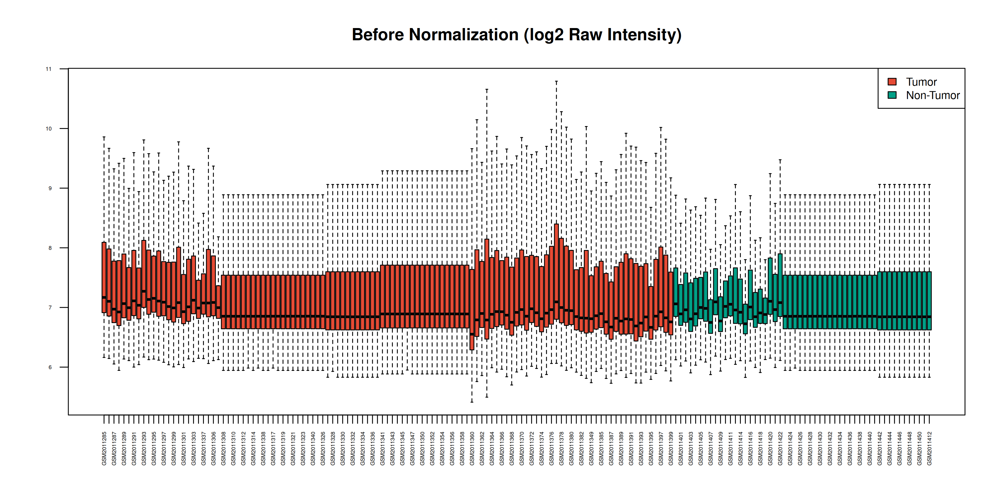
  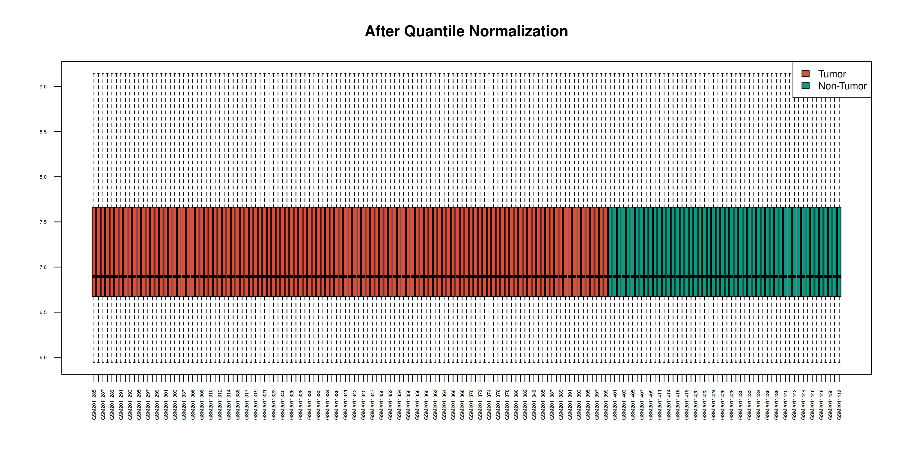

<em>Şekil 1: Normalizasyon öncesi (sol) ve sonrası (sağ) örnek bazlı kutu grafikleri</em>

  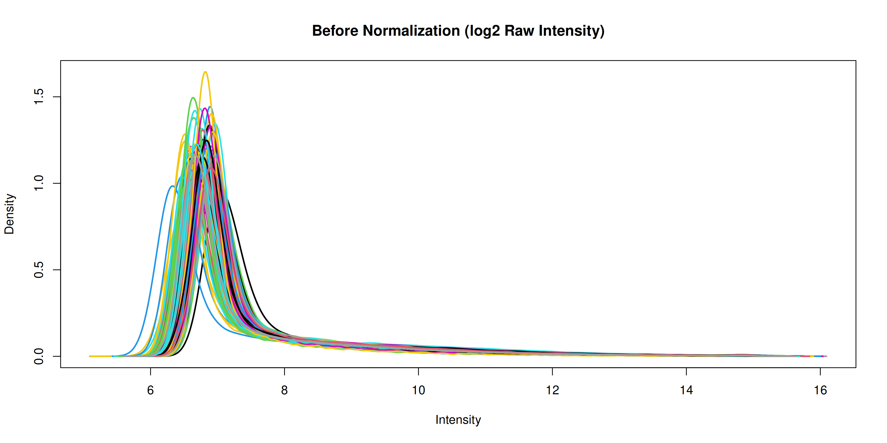
  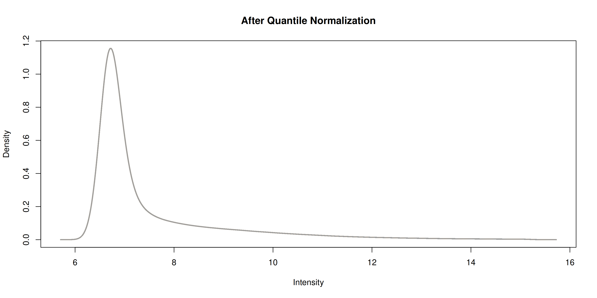

<em>Şekil 2: Normalizasyon öncesi (sol) ve sonrası (sağ) örnek bazlı yoğunluk dağılımları</em>

### Prob Filtreleme ve Gen Anotasyonu

Normalizasyon sonrasında veri setindeki düşük kaliteli ve bilgi değeri düşük problar çıkarılmıştır. Bu işlem üç adımda gerçekleştirilmiştir:

- **Detection p-value filtresi:** Örneklerin en az %10'unda güvenilir şekilde ölçülen problar tutulmuştur. Bu adım sonunda prob sayısı 47.322'den **27.050**'ye düşmüştür.
- **Varyans filtresi:** İfade değerleri örnekler arasında çok az değişen problar analizden çıkarılmıştır. Bu amaçla en düşük %10'luk varyansa sahip problar elenmiş ve prob sayısı **24.345**'e düşmüştür.
- **Gen anotasyonu:** Probe ID'leri, GSE76427 veri setinin platform bilgisi kullanılarak gen sembollerine dönüştürülmüştür. Aynı gene karşılık gelen birden fazla prob olduğunda, en yüksek varyansa sahip prob seçilmiştir.

Bu adımlar sonucunda analiz için **14.323 benzersiz gen** elde edilmiştir.

### Yüksek Varyanslı Gen (HVG) Seçimi

Filtreleme ve anotasyon adımlarından sonra genler, örnekler arasındaki değişkenlik düzeylerine göre sıralanmıştır. En yüksek varyansa sahip **3000 gen** seçilerek HVG listesi oluşturulmuştur.

Bu adımın amacı, örnekler arasında çok az değişen ve analizlere sınırlı katkı sağlayan genleri dışarıda bırakmaktır. Böylece PCA, WGCNA ve makine öğrenmesi analizlerinde daha bilgilendirici genlerle çalışılmıştır.

### Keşifsel Veri Analizi

HVG seçimi öncesi ve sonrası temel bileşen analizi (PCA) aşağıda verilmiştir. Sınıflara göre renklendirilmiş PCA grafiğinde tümör ve non-tümör örnekleri belirgin biçimde ayrışmaktadır. En yüksek varyansa sahip 20 gene ait ısı haritası iki doku tipinin ayrı kümeler oluşturduğunu göstermektedir.

  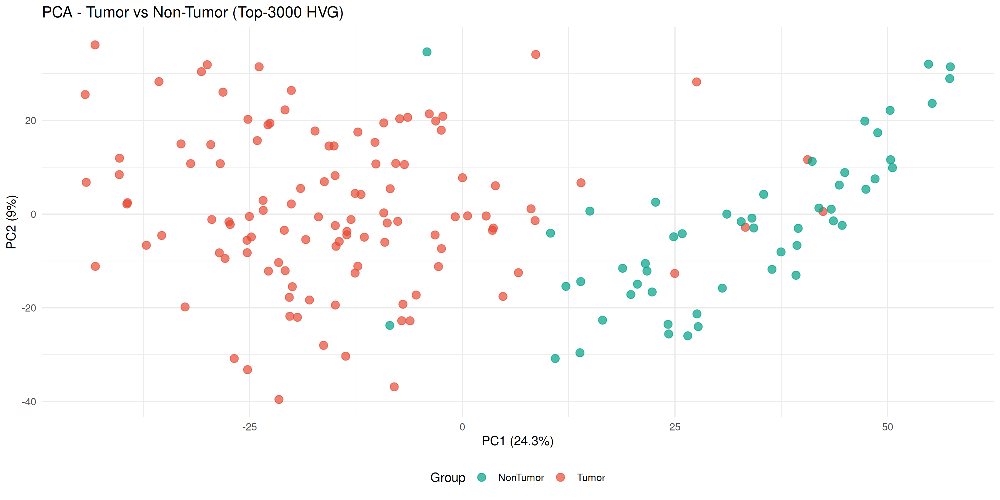

<em>Şekil 3: Top-3000 HVG ile gruplara göre renklendirilmiş PCA grafiği</em>

  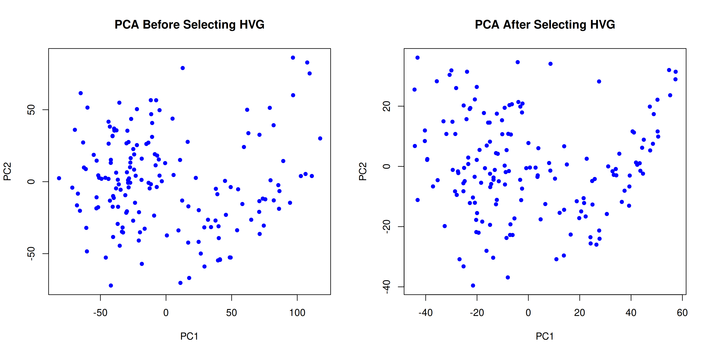

<em>Şekil 4: HVG seçimi öncesi (sol) ve sonrası (sağ) PCA dağılımları</em>

  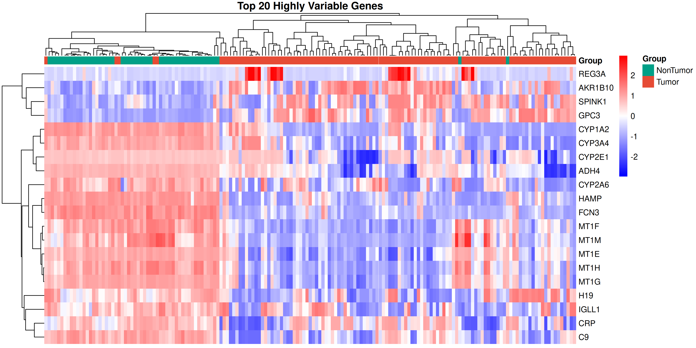

<em>Şekil 5: En yüksek varyansa sahip 20 genin grup anotasyonlu ısı haritası</em>

---

## Diferansiyel Gen İfadesi Analizi

### Yöntem

Diferansiyel gen ifadesi (DGE) analizi, prob filtreleme ve gen anotasyonu sonrası elde edilen 14.323 benzersiz gen üzerinde gerçekleştirilmiştir. HVG seçimi bu aşamada kullanılmamış, yalnızca PCA, WGCNA ve makine öğrenmesi analizleri için uygulanmıştır.

Veri setinde bazı hastalara ait hem tümör hem de komşu non-tümör örnekleri bulunduğu için eşleşmiş örnek yapısı dikkate alınmıştır. Bu amaçla hasta kimliği modele eklenmiş ve tümör ile non-tümör dokular arasındaki gen ifade farkları karşılaştırılmıştır.

Analizde `limma` paketi kullanılmıştır. Tümör ve non-tümör grupları için uygun tasarım matrisi tanımlanmıştır. Daha sonra model kurulmuş ve her gen için istatistiksel anlamlılık değerleri hesaplanmıştır.

Anlamlı genler, düzeltilmiş p-değeri **0,05'ten küçük** ve mutlak logFC değeri **1'den büyük** olacak şekilde seçilmiştir. Bu eşikler, hem istatistiksel anlamlılığı hem de ifade değişiminin büyüklüğünü birlikte değerlendirmek için kullanılmıştır.

### Sonuçlar

Analiz sonucunda **705 genin** tümör ve non-tümör örnekleri arasında anlamlı düzeyde farklı ifade edildiği belirlenmiştir: **216 up-regulated** ve **489 down-regulated**. Down-regulated genlerin baskınlığı, HCC dokusunda hepatositlere özgü bazı normal karaciğer fonksiyonlarının azalmış olabileceğini düşündürmektedir.

En güçlü diferansiyel ifadeli genler:

| Gen | Yön | logFC | adj.P.Val |
|---|---|---|---|
| GPC3 | Up | +3,53 | 5,91×10⁻²⁰ |
| AKR1B10 | Up | +3,06 | 6,28×10⁻¹³ |
| SPINK1 | Up | +2,89 | 1,39×10⁻⁹ |
| TOP2A | Up | +2,58 | 1,04×10⁻²⁸ |
| ACSL4 | Up | +2,53 | 1,07×10⁻¹⁷ |
| HAMP | Down | −5,00 | 2,08×10⁻²⁹ |
| CYP1A2 | Down | −4,75 | 1,49×10⁻²⁵ |
| FCN3 | Down | −4,64 | 2,11×10⁻³⁹ |
| MT1H | Down | −4,21 | 3,29×10⁻²⁵ |
| MT1G | Down | −4,04 | 4,16×10⁻²³ |

### Görselleştirmeler

  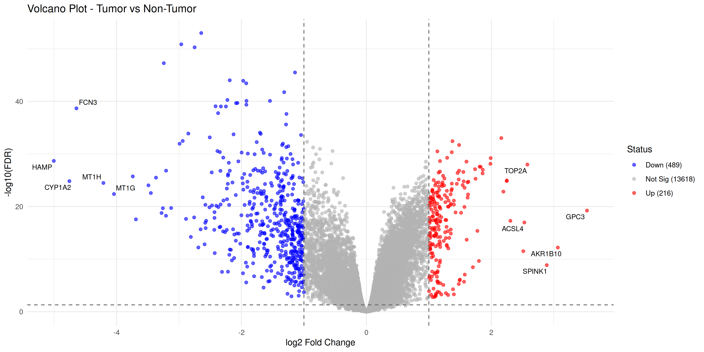

<em>Şekil 6: Diferansiyel gen ifadesi volkan grafiği (kırmızı: up, mavi: down)</em>

  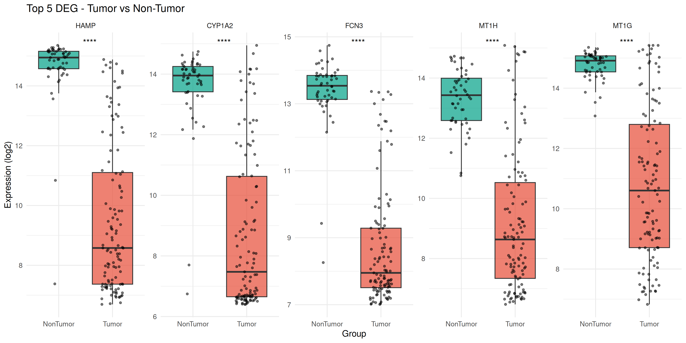

<em>Şekil 7: En güçlü 5 DEG için kutu grafikleri</em>

  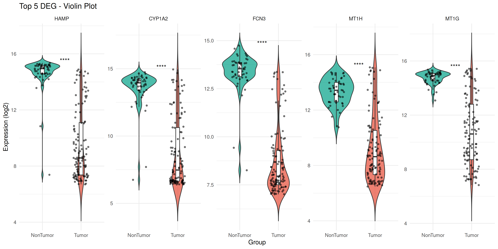

<em>Şekil 8: En güçlü 5 DEG için keman grafikleri</em>

  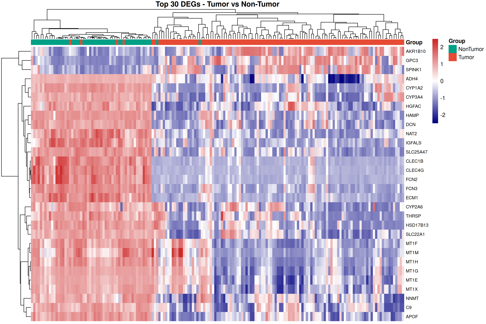

<em>Şekil 9: En anlamlı diferansiyel ifadeli genlerin ısı haritası</em>

### Biyolojik Yorum

Down-regulated genler arasında **HAMP**, **CYP1A2**, **FCN3**, **MT1H** ve **MT1G** öne çıkmaktadır. Bu genler demir dengesi, ilaç metabolizması, bağışıklık yanıtı ve metal detoksifikasyonu gibi karaciğerin normal görevleriyle ilişkilidir. Bu nedenle tümör dokusunda bu genlerin daha düşük ifade göstermesi, normal karaciğer fonksiyonlarının azaldığını düşündürmektedir.

Up-regulated genler arasında ise **GPC3**, **AKR1B10** ve **TOP2A** dikkat çekmektedir. Bu genler hücre çoğalması ve tümör gelişimiyle ilişkili süreçlerde rol oynayabilir. Özellikle GPC3'ün HCC tanısında bilinen bir gen belirteci olması, elde edilen DGE sonuçlarının biyolojik olarak tutarlı olduğunu göstermektedir.

---

## Survival Analizi ve Cox Modeli

### Yöntem

Survival analizi yalnızca tümör örnekleri üzerinde yapılmıştır. Ana değerlendirme ölçütü genel sağkalım (OS) olarak seçilmiştir. Bu analizde 115 tümör örneği kullanılmış ve 23 ölüm olayı bulunmaktadır.

DGE analizinden seçilen en güçlü 5 up-regulated ve 5 down-regulated gen olmak üzere toplam 10 gen incelenmiştir. Her gen için örnekler, gen ifade değerinin medyanına göre yüksek ifade ve düşük ifade gruplarına ayrılmıştır. Bu gruplar Kaplan-Meier eğrileri ve log-rank testi ile karşılaştırılmıştır.

Ek olarak, gen ifade grubu, yaş ve cinsiyet değişkenleri kullanılarak Cox regresyon modeli kurulmuştur. Tekrarsız sağkalım (RFS) ikincil olarak değerlendirilmiş, ancak düzeltilmiş örnek eşleştirmesi sonrasında RFS için anlamlı bir gen bulunmamıştır.

### Sonuçlar

Kaplan-Meier log-rank test sonuçları aşağıda verilmiştir. Üç gen anlamlı bulunmuştur: **MT1G** (p = 0,006), **MT1H** (p = 0,023) ve **AKR1B10** (p = 0,039).

| Gen | Yön | p-değeri |
|---|---|---|
| **MT1G** | Down | **0,006** |
| **MT1H** | Down | **0,023** |
| **AKR1B10** | Up | **0,039** |
| FCN3 | Down | 0,087 |
| GPC3 | Up | 0,633 |
| SPINK1 | Up | 0,403 |
| TOP2A | Up | 0,468 |
| ACSL4 | Up | 0,474 |
| CYP1A2 | Down | 0,460 |
| HAMP | Down | 0,680 |

  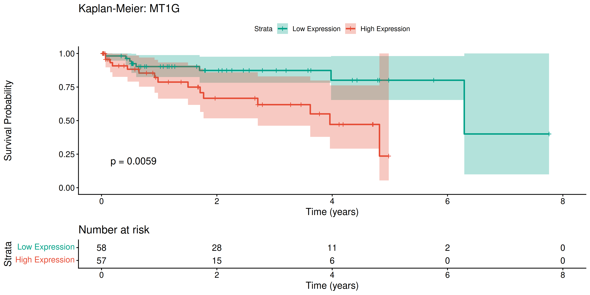

<em>Şekil 10: MT1G geni için Kaplan-Meier genel sağkalım (OS) eğrisi</em>

  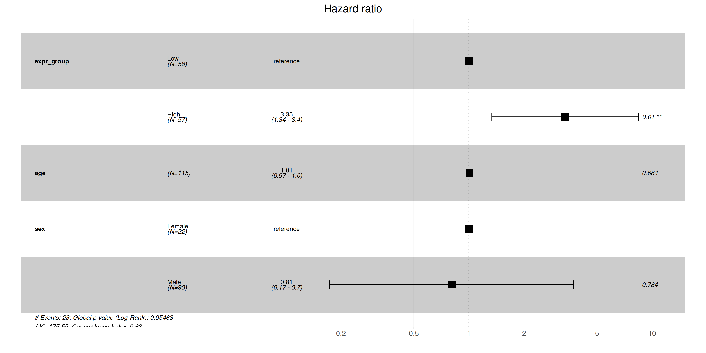

<em>Şekil 11: MT1G geni için Cox regresyon forest plot grafiği</em>

### Yorum

Cox modelinde yüksek MT1G ifade grubunun ölüm riski daha yüksek bulunmuştur (HR = 3,35; %95 GA 1,34–8,41; p = 0,010). Benzer şekilde MT1H için de daha yüksek risk gözlenmiştir (HR = 2,65; p = 0,029). AKR1B10 ise koruyucu yönde bir eğilim göstermiştir, ancak bu sonuç sınırda anlamlıdır (HR = 0,41; p = 0,052).

MT1G ve MT1H tümör dokusunda genel olarak daha düşük ifade edilen genlerdir. Buna rağmen, tümör örnekleri içinde bu genlerin daha yüksek ifade edilmesi sağkalım ile ilişkili bulunmuştur. Cox modeline yaş ve cinsiyet dahil edilmiş; olay sayısı düşük olduğu için BCLC evresi modele eklenmemiştir. Metadata'da sigara ve alkol bilgisi bulunmadığından bu değişkenler değerlendirilememiştir.

---

## WGCNA Analizi

### Yöntem

WGCNA, benzer ifade örüntüsüne sahip genleri aynı gruplar altında toplayan bir ağ analizi yöntemidir. Bu analizde Top-3000 yüksek varyanslı gen kullanılmıştır.

Ağ yapısını oluşturmak için önce genler arasındaki ilişki düzeyi hesaplanmıştır. Daha sonra ölçeksiz topolojiye uygunluğu sağlayan Soft Thresholding gücü **β = 5** olarak seçilmiştir. Bu değer kullanılarak genler arasındaki bağlantılar hesaplanmış ve benzer bağlantı yapısına sahip genler modüller halinde gruplandırılmıştır.

  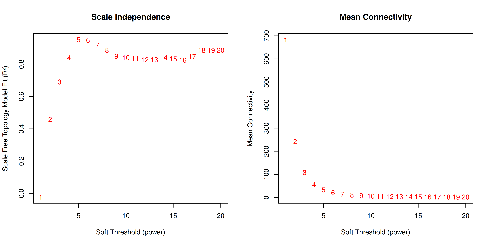

<em>Şekil 12: Soft Threshold güç seçimi: ölçeksiz topoloji uyumu ve ortalama bağlantısallık</em>

### Modül Tespiti ve Modül-Trait İlişkisi

Analiz sonucunda **6 gen modülü** belirlenmiştir. Daha sonra bu modüllerin tümör/non-tümör durumu ve klinik değişkenlerle ilişkisi incelenmiştir.

Bu karşılaştırmada **brown modülü** 1636 gen içermekte ve tümör/non-tümör ayrımıyla en güçlü ilişkiyi göstermektedir. Bu nedenle sonraki hub gen ve GO analizlerinde brown modülü seçilmiştir.

  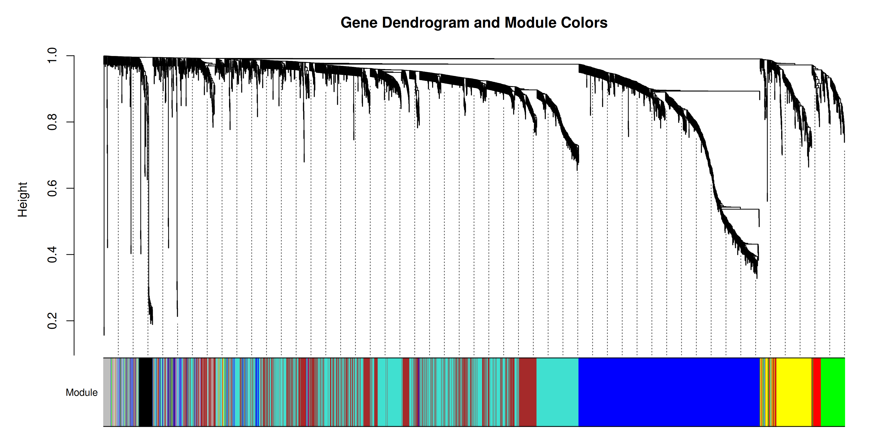

<em>Şekil 13: Gen dendrogramı ve modül renkleri</em>

  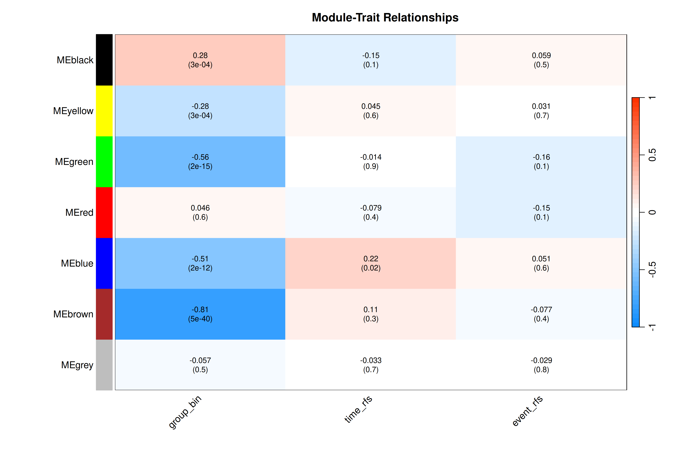

<em>Şekil 14: Modül-Trait ilişki ısı haritası</em>

### Hub Genler

Hub genler, her modül içinde merkeze yakın ve tümör/non-tümör ayrımıyla güçlü ilişki gösteren genler arasından seçilmiştir. Bu seçimde modül üyeliği (kME) ve gen anlamlılığı (GS) değerleri dikkate alınmıştır.

| Gen | kME | GS | Fonksiyon |
|---|---|---|---|
| GLYATL1 | 0,92 | 0,70 | Glisin konjugasyonu, karaciğer detoksifikasyonu |
| TTC36 | 0,92 | 0,82 | p53 stabilizasyonu |
| PEX11G | 0,90 | 0,69 | Peroksizomal bölünme, lipid metabolizması |
| AADAT | 0,90 | 0,80 | Kinürenin yolağı, amino asit metabolizması |
| NAT2 | 0,89 | 0,77 | N-asetiltransferaz, ilaç metabolizması |

  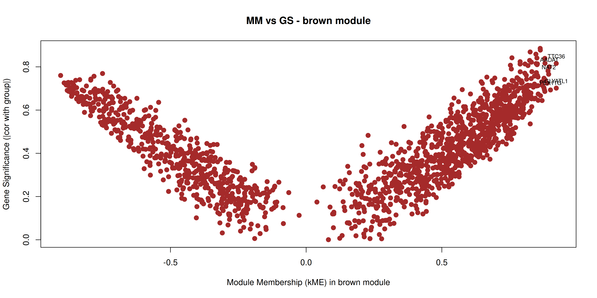

<em>Şekil 15: Brown modülü için Module Membership (MM) – Gene Significance (GS) dağılımı</em>

  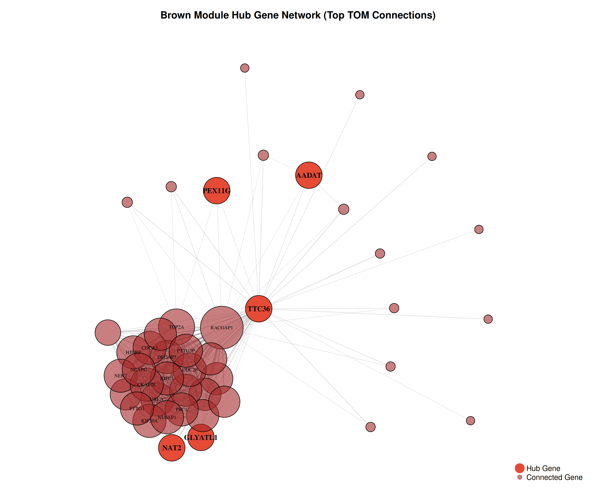

<em>Şekil 16: Brown modülü hub gen merkezli co-expression ağı</em>

---

## GO Enrichment Analizi

### Yöntem

Brown modülünde yer alan 1636 gen için GO enrichment analizi yapılmıştır. Bu analizde, genlerin hangi biyolojik süreçlerle daha fazla ilişkili olduğunu belirlemek amaçlanmıştır.

Analiz sonucunda elde edilen p-değerleri Benjamini-Hochberg yöntemi ile düzeltilmiş ve anlamlı GO terimleri belirlenmiştir.

### Sonuçlar

Brown modülü için **752 anlamlı Biyolojik Süreç terimi** tespit edilmiştir. En anlamlı terimler:

| GO Terimi | p.adjust | Gen Sayısı |
|---|---|---|
| Small molecule catabolic process | 3,85×10⁻⁵⁴ | 138 |
| Organic acid catabolic process | 8,60×10⁻⁵⁰ | 108 |
| Carboxylic acid catabolic process | 8,60×10⁻⁵⁰ | 108 |
| Alpha-amino acid metabolic process | 4,60×10⁻³⁶ | 84 |
| Organic acid biosynthetic process | 8,77×10⁻³⁶ | 108 |
| Amino acid metabolic process | 4,44×10⁻³² | 95 |
| Fatty acid metabolic process | 7,55×10⁻³⁰ | 110 |

  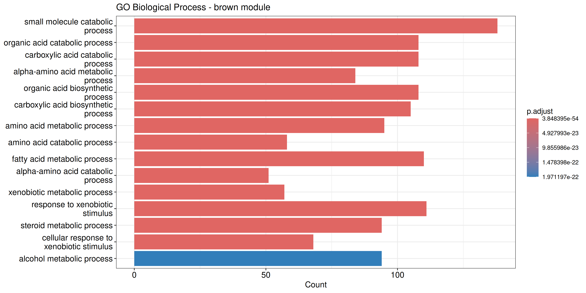

<em>Şekil 17: GO Biyolojik Süreç bar grafiği</em>

  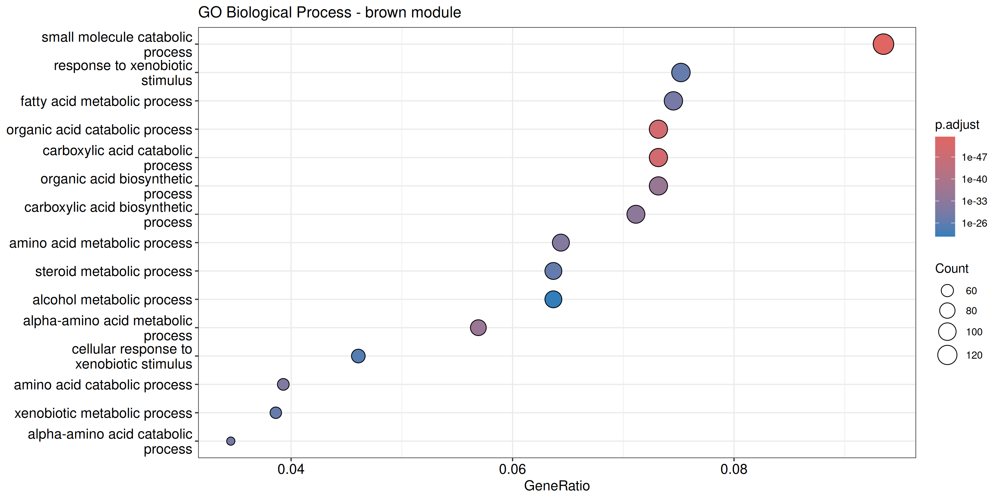

<em>Şekil 18: GO Biyolojik Süreç nokta grafiği</em>

### Biyolojik Yorum

En anlamlı GO terimleri küçük molekül yıkımı, amino asit metabolizması ve yağ asidi metabolizması ile ilişkilidir. Bu süreçler karaciğerin temel görevleri arasında yer almaktadır.

Brown modülünün tümör örnekleriyle negatif ilişki göstermesi, HCC dokusunda normal karaciğer metabolizmasıyla ilişkili genlerin daha düşük ifade edildiğini düşündürmektedir. Bu sonuç, tümör dokusunda metabolik kapasitenin azalabileceği yorumunu desteklemektedir.

---

## Makine Öğrenmesi ile Sınıflandırma

### Özellik Seçimi/Çıkarımı Setup'ları

Tümör/non-tümör sınıflandırması için üç farklı özellik stratejisi karşılaştırılmıştır:

| Özellik Seti | Özellik Sayısı | Yöntem |
|---|---|---|
| Biyolojik | 742 gen | DGE sonucunda bulunan anlamlı genler ve WGCNA hub genleri |
| İstatistiksel | 446 gen | Yüksek varyanslı ve birbirine çok benzemeyen genler |
| PCA | 35 bileşen | Gen ifade verilerinin PCA ile özetlenmiş hali (%80 varyans) |

### Modeller ve Değerlendirme

Üç farklı eğiticili makine öğrenmesi modeli kullanılmıştır: **SVM**, **Random Forest** ve **XGBoost**. Modeller, çapraz doğrulama ile değerlendirilmiştir. Bu yöntemde aynı hastaya ait tümör ve non-tümör örnekleri aynı katta tutulmuş, böylece aynı hastadan gelen örneklerin hem eğitim hem test verisine düşmesi engellenmiştir.

Sınıflandırmada pozitif sınıf Tümör olarak belirlenmiştir. PCA kullanılan Setup-3'te, boyut indirgeme işlemi her çapraz doğrulama katında yalnızca eğitim verisi üzerinde öğrenilmiştir. Böylece test verisinden modele bilgi sızması önlenmiştir.

### Sonuçlar

Tüm modeller **%93 üzeri accuracy** ve **0,95 üzeri AUC** değeri elde etmiştir.

| Özellik Seti | Model | Acc | Prec | Recall | F1 | AUC |
|---|---|---|---|---|---|---|
| Biyolojik | SVM | 0,946 | 0,965 | 0,957 | 0,961 | 0,975 |
| Biyolojik | Random Forest | **0,958** | 0,974 | 0,965 | 0,969 | 0,980 |
| Biyolojik | XGBoost | 0,952 | 0,965 | 0,965 | 0,965 | 0,973 |
| İstatistiksel | SVM | 0,946 | 0,965 | 0,957 | 0,961 | 0,962 |
| İstatistiksel | Random Forest | **0,958** | 0,966 | **0,974** | **0,970** | **0,981** |
| İstatistiksel | XGBoost | 0,946 | 0,957 | 0,965 | 0,961 | 0,968 |
| PCA | SVM | **0,958** | **0,982** | 0,957 | 0,969 | 0,967 |
| PCA | Random Forest | 0,934 | 0,956 | 0,948 | 0,952 | 0,973 |
| PCA | XGBoost | 0,934 | 0,956 | 0,948 | 0,952 | 0,959 |

### ROC Eğrileri

  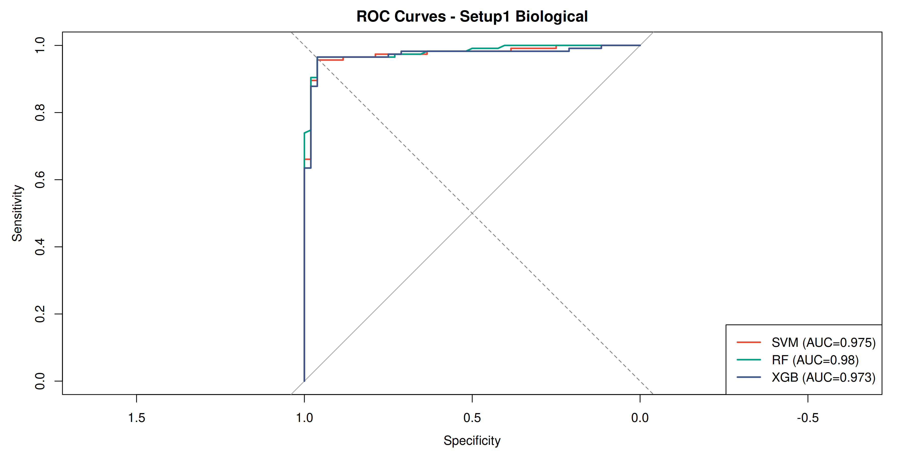

<em>Şekil 19: Biyolojik özellik seti ROC eğrileri</em>

  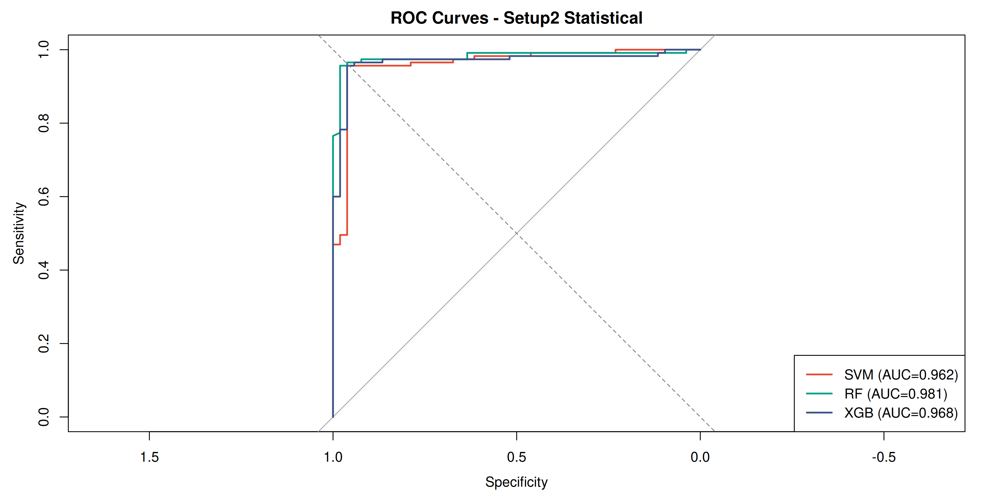

<em>Şekil 20: İstatistiksel özellik seti ROC eğrileri</em>

  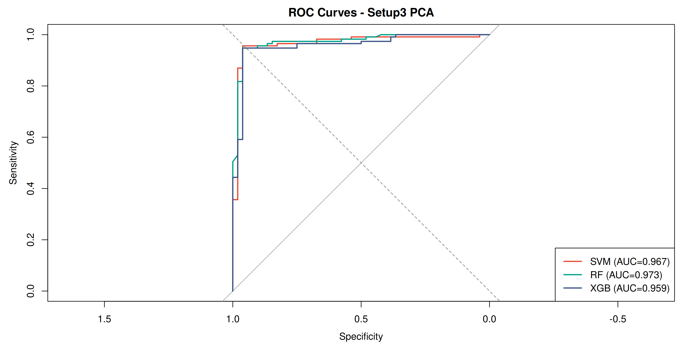

<em>Şekil 21: PCA özellik seti ROC eğrileri</em>

### Karışıklık Matrisleri

  
  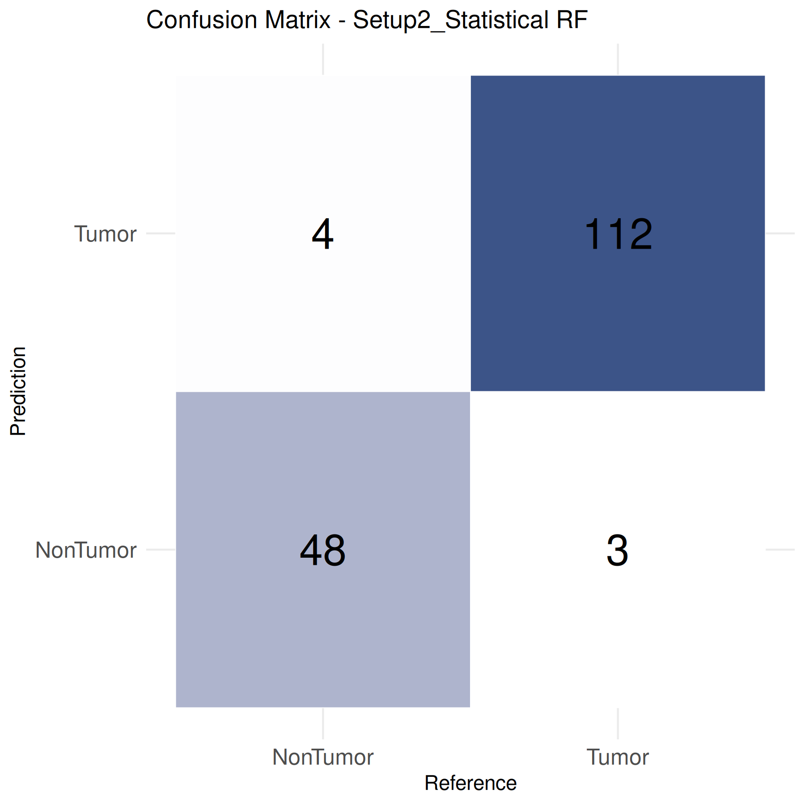
  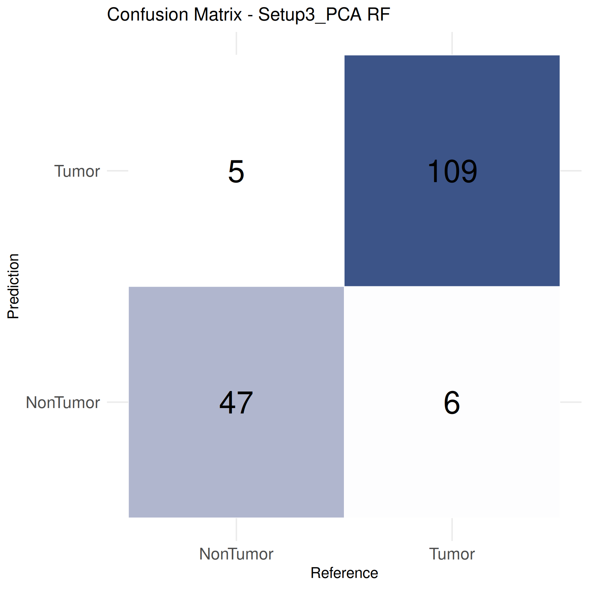

<em>Şekil 22: Random Forest karışıklık matrisleri (sırasıyla Biyolojik, İstatistiksel, PCA)</em>

### Karşılaştırma ve Yorum

Biyolojik ve istatistiksel özellik setleri benzer performans göstermiştir. Bu sonuç, DGE ve WGCNA analizleriyle seçilen genlerin tümör/non-tümör ayrımında yararlı bilgiler taşıdığını göstermektedir. PCA tabanlı özellik seti de daha az sayıda bileşen kullanmasına rağmen başarılı sonuçlar vermiştir.

Modeller arasında Random Forest, tüm özellik setlerinde yüksek ve tutarlı AUC değerleri elde etmiştir. En yüksek AUC değeri, istatistiksel özellik seti ile Random Forest modelinde elde edilmiştir (**AUC = 0,981**).

Değerlendirmede hasta-bazlı çapraz doğrulama kullanıldığı için aynı hastaya ait örneklerin hem eğitim hem test kümesine düşmesi engellenmiştir. Ayrıca PCA kullanılan özellik setinde boyut indirgeme işlemi her fold içinde yalnızca eğitim verisi üzerinde yapılmıştır. Bununla birlikte, biyolojik ve istatistiksel gen listeleri tüm veri seti üzerinde belirlendiği için bu iki özellik seti keşifsel karşılaştırma olarak değerlendirilmelidir.

---

## Sonuçlar

Bu projede GSE76427 hepatosellüler karsinom veri seti üzerinde gen ifadesi analizi, survival analizi, WGCNA, GO enrichment analizi ve makine öğrenmesi tabanlı sınıflandırma uygulanmıştır. Çalışmada tümör ve non-tümör dokular arasındaki gen ifade farklılıkları incelenmiş, bu farklılıkların biyolojik anlamı değerlendirilmiş ve elde edilen gen listelerinin sınıflandırma başarısına katkısı karşılaştırılmıştır.

1. **Diferansiyel gen ifadesi analizi**, prob filtreleme ve gen anotasyonu sonrası elde edilen 14.323 benzersiz gen üzerinde gerçekleştirilmiştir. Tümör ve non-tümör dokular arasında 705 gen anlamlı düzeyde farklı ifade göstermiştir. Bu genlerin 216'sı tümör dokusunda daha yüksek, 489'u ise daha düşük ifade edilmiştir.

2. **DGE sonuçlarında** GPC3, AKR1B10, SPINK1, TOP2A ve ACSL4 tümör dokusunda daha yüksek ifade edilen genler arasında öne çıkmıştır. HAMP, CYP1A2, FCN3, MT1H ve MT1G ise tümör dokusunda daha düşük ifade göstermiştir. Bu sonuçlar, HCC dokusunda bazı tümörle ilişkili genlerin arttığını, buna karşılık normal karaciğer fonksiyonlarıyla ilişkili bazı genlerin azaldığını göstermektedir.

3. **Survival analizinde** genel sağkalım temel alınmıştır. İncelenen genler arasında MT1G, MT1H ve AKR1B10 Kaplan-Meier analizinde anlamlı sonuçlar göstermiştir. Cox modelinde özellikle yüksek MT1G ifadesi daha yüksek ölüm riskiyle ilişkili bulunmuştur. Bu sonuç, bazı genlerin yalnızca tümör/non-tümör ayrımında değil, tümör örnekleri içinde survival ile ilişkili olabileceğini göstermektedir.

4. **WGCNA analizi** ile 6 gen modülü belirlenmiştir. Brown modülü, tümör/non-tümör ayrımıyla en güçlü ilişki gösteren modül olarak seçilmiştir. Bu modülde yer alan hub genler, modülü temsil etme gücü ve tümör/non-tümör ayrımıyla ilişkisi dikkate alınarak belirlenmiştir.

5. **GO enrichment analizi**, brown modülündeki genlerin özellikle küçük molekül metabolizması, amino asit metabolizması ve yağ asidi metabolizması gibi karaciğerin temel görevleriyle ilişkili süreçlerde yoğunlaştığını göstermiştir. Bu bulgu, tümör dokusunda normal karaciğer metabolizmasıyla ilişkili genlerin baskılanabileceği yorumunu desteklemektedir.

6. **Makine öğrenmesi aşamasında** üç farklı özellik seti ve üç farklı model karşılaştırılmıştır. Modeller genel olarak yüksek başarı göstermiştir. En yüksek AUC değeri, istatistiksel özellik seti ile Random Forest modelinde elde edilmiştir.

Genel olarak sonuçlar, HCC tümör dokusunun gen ifade profili bakımından non-tümör dokudan belirgin şekilde ayrıldığını göstermektedir. Tümör dokusunda normal karaciğer metabolizmasıyla ilişkili bazı genlerin daha düşük, tümör gelişimiyle ilişkili bazı genlerin ise daha yüksek ifade edildiği görülmüştür. Bu ifade değişimleri hem biyolojik analizlerde anlamlı örüntüler oluşturmuş hem de makine öğrenmesi modelleriyle tümör/non-tümör ayrımının başarılı şekilde yapılmasını sağlamıştır.

---

## Kısaltmalar

| Kısaltma | Açıklama |
|---|---|
| AUC | Area Under the Curve (ROC Eğrisi Altındaki Alan) |
| Cox | Cox Orantılı Hazardlar Modeli |
| DGE | Differential Gene Expression (Diferansiyel Gen İfadesi) |
| GEO | Gene Expression Omnibus |
| GO | Gene Ontology |
| GS | Gene Significance (Gen Anlamlılığı) |
| HCC | Hepatocellular Carcinoma (Hepatosellüler Karsinom) |
| HVG | Highly Variable Genes (Yüksek Varyanslı Genler) |
| kME | Module Membership (Modül Üyeliği) |
| logFC | Log2 Fold Change |
| OS | Overall Survival (Genel Sağkalım) |
| PCA | Principal Component Analysis (Temel Bileşen Analizi) |
| RFS | Recurrence-Free Survival (Nükssüz Sağkalım) |
| ROC | Receiver Operating Characteristic |
| SVM | Support Vector Machine (Destek Vektör Makinesi) |
| WGCNA | Weighted Gene Co-expression Network Analysis |

---

 

# English Version

---

# Gene Expression Analysis and Machine Learning–Based Classification of Hepatocellular Carcinoma

**BLM3810 Introduction to Bioinformatics — Term Project**

Yıldız Technical University · Department of Computer Engineering

Dr. S. Sevgi Turgut Ögme

June, 2026

---

## Table of Contents

- [Introduction](#introduction)
- [Dataset and Preprocessing](#dataset-and-preprocessing)
- [Differential Gene Expression Analysis](#differential-gene-expression-analysis)
- [Survival Analysis and Cox Model](#survival-analysis-and-cox-model)
- [WGCNA Analysis](#wgcna-analysis-1)
- [GO Enrichment Analysis](#go-enrichment-analysis-1)
- [Machine Learning Classification](#machine-learning-classification)
- [Conclusions](#conclusions)
- [Abbreviations](#abbreviations)

---

## Introduction

Cancer is a group of diseases characterized by uncontrolled cell growth and represents one of the leading causes of death worldwide. In cancerous tissues, the expression levels of numerous genes exhibit marked alterations relative to normal tissues. While certain genes become overexpressed, others are suppressed. Identifying these differences is critical for discovering cancer-associated genes and developing solutions that may inform diagnosis or prognosis.

In this project, fundamental bioinformatics analyses were applied to gene expression data pertaining to **Hepatocellular Carcinoma (HCC)**, a primary liver cancer, and the resulting biological findings were formulated as a machine learning classification problem.

### Objective

The aim of this study is to apply differential gene expression analysis, survival analysis, WGCNA, and GO enrichment analyses on gene expression datasets, and to develop machine learning models capable of distinguishing tumor from normal tissue using the obtained results. The project comprises two phases:

- **Phase I:** Dataset selection, preprocessing, differential gene expression analysis, survival analysis, WGCNA, and GO enrichment analyses.
- **Phase II:** Tumor/normal tissue classification via machine learning using different feature selection/extraction strategies.

### Dataset Information

The dataset used in this study was obtained from the NCBI GEO database under accession number **GSE76427** for hepatocellular carcinoma.

| Attribute | Value |
|---|---|
| GEO Accession | GSE76427 |
| Disease | Hepatocellular Carcinoma (Liver Cancer) |
| Organism | Homo sapiens |
| Total Samples | 167 |
| Tumor Tissue | 115 primary HCC specimens |
| Non-Tumor Tissue | 52 adjacent non-tumor liver tissue samples |
| Classification Label | Tumor vs. Non-Tumor |
| Age Range | 14–93 |
| Sex | 93 Male / 22 Female (for 115 tumor samples with clinical metadata) |
| Survival Data | OS: 115 samples, 23 death events; RFS: 108 samples, 48 recurrence events |

The dataset satisfies the project requirements by containing two comparable classes (tumor and non-tumor), possessing survival metadata, and not employing cancer stage as the classification label.

---

## Dataset and Preprocessing

### Data Acquisition

The dataset was downloaded from the NCBI GEO database. The analysis utilized non-normalized raw gene expression data for the GSE76427 dataset, which contains expression values and Detection P-values indicating measurement reliability for each probe.

The raw data initially comprised **47,322 probes** across **167 samples**. Since all expression values were positive, a log2 transformation was applicable.

### Normalization

The following steps were applied sequentially to the raw data:

1. **Log2 transformation:** Applied to compress the dynamic range and symmetrize the distribution.
2. **Quantile normalization:** Applied to reduce technical variability across samples and render gene expression values comparable.

Pre- and post-normalization sample distributions are presented in the figures below. Following normalization, the medians and distributions of all samples were aligned.

  
  

<em>Figure 1: Sample-wise box plots before (left) and after (right) normalization</em>

  
  

<em>Figure 2: Sample-wise density distributions before (left) and after (right) normalization</em>

### Probe Filtering and Gene Annotation

Following normalization, low-quality probes with limited informational value were removed from the dataset. This process was conducted in three steps:

- **Detection p-value filter:** Probes reliably detected in at least 10% of samples were retained, reducing the probe count from 47,322 to **27,050**.
- **Variance filter:** Probes exhibiting minimal variation across samples were excluded. Probes in the lowest 10th percentile of variance were removed, reducing the count to **24,345**.
- **Gene annotation:** Probe IDs were mapped to gene symbols using the platform annotation of the GSE76427 dataset. When multiple probes corresponded to the same gene, the probe with the highest variance was selected.

These steps yielded **14,323 unique genes** for downstream analysis.

### Highly Variable Gene (HVG) Selection

Following filtering and annotation, genes were ranked by their variability across samples. The top **3,000 genes** with the highest variance were selected to form the HVG list.

The purpose of this step was to exclude genes with minimal variation across samples that contribute limited information to downstream analyses. This enabled more informative gene sets for PCA, WGCNA, and machine learning analyses.

### Exploratory Data Analysis

Principal component analysis (PCA) before and after HVG selection is presented below. In the PCA plot colored by class, tumor and non-tumor samples exhibit clear separation. The heatmap of the top 20 genes by variance demonstrates that the two tissue types form distinct clusters.

  

<em>Figure 3: PCA plot colored by group using top-3,000 HVGs</em>

  

<em>Figure 4: PCA distributions before (left) and after (right) HVG selection</em>

  

<em>Figure 5: Heatmap of the top 20 genes by variance with group annotation</em>

---

## Differential Gene Expression Analysis

### Methods

Differential gene expression (DGE) analysis was performed on the 14,323 unique genes obtained after probe filtering and gene annotation. HVG selection was not applied at this stage; it was reserved for PCA, WGCNA, and machine learning analyses.

Since the dataset contained both tumor and adjacent non-tumor samples from certain patients, the paired sample structure was accounted for. Patient identity was incorporated into the model, and gene expression differences between tumor and non-tumor tissues were compared.

The `limma` package was employed for the analysis. An appropriate design matrix was defined for tumor and non-tumor groups. The model was subsequently fitted, and statistical significance values were computed for each gene.

Significant genes were selected based on an adjusted p-value **less than 0.05** and an absolute logFC **greater than 1**. These thresholds were applied to jointly evaluate both statistical significance and the magnitude of expression change.

### Results

The analysis identified **705 genes** as significantly differentially expressed between tumor and non-tumor samples: **216 up-regulated** and **489 down-regulated**. The predominance of down-regulated genes suggests that certain normal hepatocyte-specific liver functions may be diminished in HCC tissue.

The most strongly differentially expressed genes are presented below:

| Gene | Direction | logFC | adj.P.Val |
|---|---|---|---|
| GPC3 | Up | +3.53 | 5.91×10⁻²⁰ |
| AKR1B10 | Up | +3.06 | 6.28×10⁻¹³ |
| SPINK1 | Up | +2.89 | 1.39×10⁻⁹ |
| TOP2A | Up | +2.58 | 1.04×10⁻²⁸ |
| ACSL4 | Up | +2.53 | 1.07×10⁻¹⁷ |
| HAMP | Down | −5.00 | 2.08×10⁻²⁹ |
| CYP1A2 | Down | −4.75 | 1.49×10⁻²⁵ |
| FCN3 | Down | −4.64 | 2.11×10⁻³⁹ |
| MT1H | Down | −4.21 | 3.29×10⁻²⁵ |
| MT1G | Down | −4.04 | 4.16×10⁻²³ |

### Visualizations

  

<em>Figure 6: Differential gene expression volcano plot (red: up-regulated, blue: down-regulated)</em>

  

<em>Figure 7: Box plots for the top 5 DEGs</em>

  

<em>Figure 8: Violin plots for the top 5 DEGs</em>

  

<em>Figure 9: Heatmap of the most significant differentially expressed genes</em>

### Biological Interpretation

Among the down-regulated genes, **HAMP**, **CYP1A2**, **FCN3**, **MT1H**, and **MT1G** are particularly prominent. These genes are associated with core hepatic functions including iron homeostasis, drug metabolism, innate immunity, and metal detoxification. Their reduced expression in tumor tissue therefore suggests a decline in normal liver functions.

Among the up-regulated genes, **GPC3**, **AKR1B10**, and **TOP2A** are noteworthy. These genes participate in processes related to cell proliferation and tumor development. The identification of GPC3, a well-established biomarker for HCC diagnosis, corroborates the biological consistency of the DGE results.

---

## Survival Analysis and Cox Model

### Methods

Survival analysis was conducted exclusively on tumor samples. Overall survival (OS) was selected as the primary endpoint. The analysis utilized 115 tumor samples with 23 death events.

A total of 10 genes were examined, comprising the top 5 up-regulated and top 5 down-regulated genes from the DGE analysis. For each gene, samples were stratified into high-expression and low-expression groups based on the median expression value. These groups were compared using Kaplan-Meier curves and log-rank tests.

Additionally, Cox proportional hazards regression models were fitted incorporating gene expression group, age, and sex as covariates. Recurrence-free survival (RFS) was evaluated as a secondary endpoint; however, no gene achieved significance for RFS after corrected sample matching.

### Results

Kaplan-Meier log-rank test results are presented below. Three genes were found to be significant: **MT1G** (p = 0.006), **MT1H** (p = 0.023), and **AKR1B10** (p = 0.039).

| Gene | Direction | p-value |
|---|---|---|
| **MT1G** | Down | **0.006** |
| **MT1H** | Down | **0.023** |
| **AKR1B10** | Up | **0.039** |
| FCN3 | Down | 0.087 |
| GPC3 | Up | 0.633 |
| SPINK1 | Up | 0.403 |
| TOP2A | Up | 0.468 |
| ACSL4 | Up | 0.474 |
| CYP1A2 | Down | 0.460 |
| HAMP | Down | 0.680 |

  

<em>Figure 10: Kaplan-Meier overall survival (OS) curve for the MT1G gene</em>

  

<em>Figure 11: Cox regression forest plot for the MT1G gene</em>

### Interpretation

The Cox model revealed that the high MT1G expression group exhibited a significantly elevated mortality risk (HR = 3.35; 95% CI 1.34–8.41; p = 0.010). Similarly, MT1H was associated with increased risk (HR = 2.65; p = 0.029). AKR1B10 demonstrated a protective trend; however, this finding was borderline significant (HR = 0.41; p = 0.052).

MT1G and MT1H are genes generally expressed at lower levels in tumor tissue relative to non-tumor tissue. Nevertheless, within tumor samples, higher expression of these genes was found to be associated with poorer survival outcomes. Age and sex were included as covariates in the Cox model; BCLC stage was not incorporated due to the limited number of events. Smoking and alcohol consumption data were unavailable in the metadata and could therefore not be evaluated.

---

## WGCNA Analysis

### Methods

Weighted Gene Co-expression Network Analysis (WGCNA) is a network analysis method that groups genes with similar expression patterns into modules. The top 3,000 highly variable genes were used in this analysis.

To construct the network, pairwise correlations among genes were first computed. The soft-thresholding power **β = 5** was selected to achieve scale-free topology fit. Using this value, inter-gene connectivity was calculated, and genes with similar connectivity patterns were grouped into modules.

  

<em>Figure 12: Soft threshold power selection: scale-free topology fit and mean connectivity</em>

### Module Detection and Module–Trait Relationships

The analysis identified **6 gene modules**. The association of these modules with tumor/non-tumor status and clinical variables was subsequently examined.

The **brown module**, containing 1,636 genes, exhibited the strongest association with tumor/non-tumor status. Consequently, it was selected for subsequent hub gene and GO enrichment analyses.

  

<em>Figure 13: Gene dendrogram with module color assignments</em>

  

<em>Figure 14: Module–Trait relationship heatmap</em>

### Hub Genes

Hub genes were selected from genes that were both central within their respective modules and strongly associated with tumor/non-tumor status. Module membership (kME) and gene significance (GS) values were considered in this selection.

| Gene | kME | GS | Function |
|---|---|---|---|
| GLYATL1 | 0.92 | 0.70 | Glycine conjugation, hepatic detoxification |
| TTC36 | 0.92 | 0.82 | p53 stabilization |
| PEX11G | 0.90 | 0.69 | Peroxisomal fission, lipid metabolism |
| AADAT | 0.90 | 0.80 | Kynurenine pathway, amino acid metabolism |
| NAT2 | 0.89 | 0.77 | N-acetyltransferase, drug metabolism |

  

<em>Figure 15: Module Membership (MM) vs. Gene Significance (GS) for the brown module</em>

  

<em>Figure 16: Hub gene–centered co-expression network for the brown module</em>

---

## GO Enrichment Analysis

### Methods

Gene Ontology (GO) enrichment analysis was performed on the 1,636 genes within the brown module. The objective was to determine which biological processes were over-represented among these genes.

The resulting p-values were corrected using the Benjamini-Hochberg method, and significant GO terms were identified.

### Results

A total of **752 significant Biological Process terms** were identified for the brown module. The most significant terms are presented below:

| GO Term | p.adjust | Gene Count |
|---|---|---|
| Small molecule catabolic process | 3.85×10⁻⁵⁴ | 138 |
| Organic acid catabolic process | 8.60×10⁻⁵⁰ | 108 |
| Carboxylic acid catabolic process | 8.60×10⁻⁵⁰ | 108 |
| Alpha-amino acid metabolic process | 4.60×10⁻³⁶ | 84 |
| Organic acid biosynthetic process | 8.77×10⁻³⁶ | 108 |
| Amino acid metabolic process | 4.44×10⁻³² | 95 |
| Fatty acid metabolic process | 7.55×10⁻³⁰ | 110 |

  

<em>Figure 17: GO Biological Process bar plot</em>

  

<em>Figure 18: GO Biological Process dot plot</em>

### Biological Interpretation

The most significant GO terms are associated with small molecule catabolism, amino acid metabolism, and fatty acid metabolism — processes that constitute core hepatic functions.

The negative association of the brown module with tumor samples suggests that genes related to normal hepatic metabolism are expressed at lower levels in HCC tissue. This finding supports the interpretation that metabolic capacity may be diminished in tumor tissue.

---

## Machine Learning Classification

### Feature Selection/Extraction Setups

Three distinct feature strategies were compared for tumor/non-tumor classification:

| Feature Set | Number of Features | Method |
|---|---|---|
| Biological | 742 genes | Significant genes from DGE analysis and WGCNA hub genes |
| Statistical | 446 genes | Highly variable genes with low inter-correlation |
| PCA | 35 components | PCA-summarized gene expression data (80% variance explained) |

### Models and Evaluation

Three supervised machine learning models were employed: **SVM**, **Random Forest**, and **XGBoost**. Models were evaluated using cross-validation. In this procedure, tumor and non-tumor samples from the same patient were assigned to the same fold, thereby preventing data leakage from the same patient appearing in both training and test sets.

The positive class was designated as Tumor. In Setup 3 (PCA-based), dimensionality reduction was learned exclusively on training data within each cross-validation fold, preventing information leakage from test data into the model.

Model performance was assessed using Accuracy, Precision, Recall, F1-score, and AUC metrics.

### Results

All models achieved **greater than 93% accuracy** and **AUC values exceeding 0.95**.

| Feature Set | Model | Acc | Prec | Recall | F1 | AUC |
|---|---|---|---|---|---|---|
| Biological | SVM | 0.946 | 0.965 | 0.957 | 0.961 | 0.975 |
| Biological | Random Forest | **0.958** | 0.974 | 0.965 | 0.969 | 0.980 |
| Biological | XGBoost | 0.952 | 0.965 | 0.965 | 0.965 | 0.973 |
| Statistical | SVM | 0.946 | 0.965 | 0.957 | 0.961 | 0.962 |
| Statistical | Random Forest | **0.958** | 0.966 | **0.974** | **0.970** | **0.981** |
| Statistical | XGBoost | 0.946 | 0.957 | 0.965 | 0.961 | 0.968 |
| PCA | SVM | **0.958** | **0.982** | 0.957 | 0.969 | 0.967 |
| PCA | Random Forest | 0.934 | 0.956 | 0.948 | 0.952 | 0.973 |
| PCA | XGBoost | 0.934 | 0.956 | 0.948 | 0.952 | 0.959 |

### ROC Curves

  

<em>Figure 19: ROC curves for the Biological feature set</em>

  

<em>Figure 20: ROC curves for the Statistical feature set</em>

  

<em>Figure 21: ROC curves for the PCA feature set</em>

### Confusion Matrices

  
  
  

<em>Figure 22: Random Forest confusion matrices (Biological, Statistical, PCA, respectively)</em>

### Comparison and Interpretation

The Biological and Statistical feature sets exhibited comparable performance, indicating that genes selected through DGE and WGCNA analyses carry informative signals for tumor/non-tumor discrimination. The PCA-based feature set also yielded successful results despite utilizing fewer components.

Among the models, Random Forest achieved consistently high AUC values across all feature sets. The highest AUC was obtained with the Statistical feature set and Random Forest model (**AUC = 0.981**).

Patient-based cross-validation was employed to prevent samples from the same patient from appearing in both training and test sets. Furthermore, in the PCA-based feature set, dimensionality reduction was performed exclusively on training data within each fold. However, since the Biological and Statistical gene lists were determined using the entire dataset, these two feature sets should be regarded as exploratory comparisons.

---

## Conclusions

In this project, gene expression analysis, survival analysis, WGCNA, GO enrichment analysis, and machine learning–based classification were applied to the GSE76427 hepatocellular carcinoma dataset. The study examined gene expression differences between tumor and non-tumor tissues, evaluated the biological significance of these differences, and compared the contribution of the resulting gene lists to classification performance.

1. **Differential gene expression analysis** was performed on 14,323 unique genes obtained after probe filtering and gene annotation. A total of 705 genes were found to be significantly differentially expressed between tumor and non-tumor tissues, with 216 up-regulated and 489 down-regulated in tumor tissue.

2. **Among the DGE results**, GPC3, AKR1B10, SPINK1, TOP2A, and ACSL4 were prominent among the up-regulated genes. HAMP, CYP1A2, FCN3, MT1H, and MT1G exhibited reduced expression in tumor tissue. These findings indicate that certain tumor-associated genes are elevated in HCC tissue, while genes associated with normal hepatic functions are diminished.

3. **Survival analysis** employed overall survival as the primary endpoint. Among the examined genes, MT1G, MT1H, and AKR1B10 yielded significant results in Kaplan-Meier analysis. The Cox model identified high MT1G expression as being associated with elevated mortality risk, demonstrating that certain genes may be related to survival outcomes not only in tumor/non-tumor discrimination but also within tumor samples.

4. **WGCNA** identified 6 gene modules. The brown module exhibited the strongest association with tumor/non-tumor status and was selected for further analysis. Hub genes within this module were identified based on module membership strength and association with tumor/non-tumor differentiation.

5. **GO enrichment analysis** revealed that genes in the brown module were enriched in processes related to small molecule metabolism, amino acid metabolism, and fatty acid metabolism — core hepatic functions. This finding supports the interpretation that genes associated with normal liver metabolism may be suppressed in tumor tissue.

6. **In the machine learning phase**, three feature sets and three models were compared. All models demonstrated high performance. The highest AUC was achieved by the Random Forest model with the Statistical feature set.

Overall, the results demonstrate that HCC tumor tissue is distinctly separated from non-tumor tissue in terms of gene expression profile. In tumor tissue, genes associated with normal hepatic metabolism were expressed at lower levels, while genes related to tumor development were expressed at higher levels. These expression changes produced meaningful patterns in biological analyses and enabled successful tumor/non-tumor classification via machine learning models.

---

## Abbreviations

| Abbreviation | Description |
|---|---|
| AUC | Area Under the Curve |
| Cox | Cox Proportional Hazards Model |
| DGE | Differential Gene Expression |
| GEO | Gene Expression Omnibus |
| GO | Gene Ontology |
| GS | Gene Significance |
| HCC | Hepatocellular Carcinoma |
| HVG | Highly Variable Genes |
| kME | Module Membership |
| logFC | Log2 Fold Change |
| OS | Overall Survival |
| PCA | Principal Component Analysis |
| RFS | Recurrence-Free Survival |
| ROC | Receiver Operating Characteristic |
| SVM | Support Vector Machine |
| WGCNA | Weighted Gene Co-expression Network Analysis |
